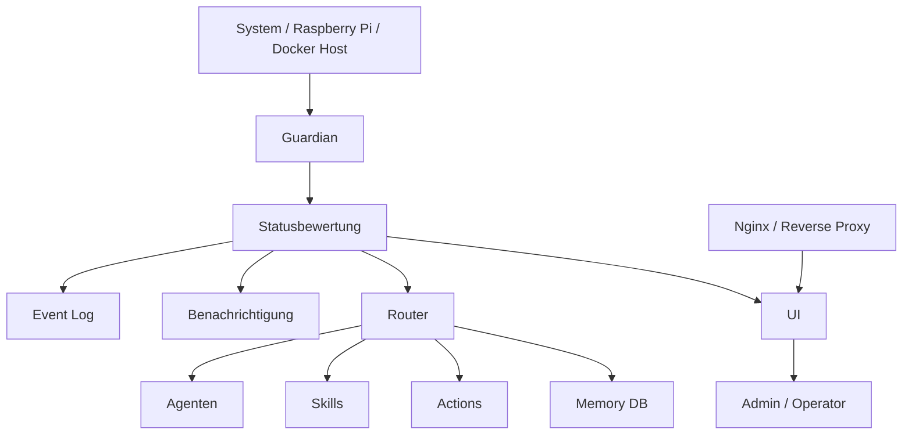
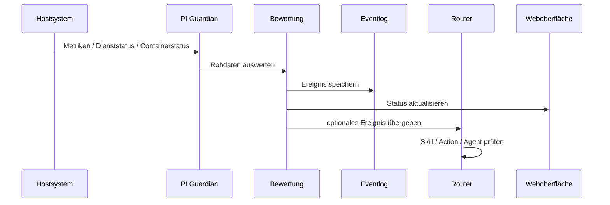

<div align="center">

# 🛡️ PI Guardian

### Modularer Wächter für Raspberry Pi, Docker, Homelab und agentengestützte Systemautomation

**Monitoring. Bewertung. Benachrichtigung. Kontrolle. Erweiterbarkeit.**


</div>

---

## 🔎 Was ist PI Guardian?

**PI Guardian** ist ein modular aufgebautes Überwachungs-, Steuerungs- und Automatisierungssystem für Raspberry-Pi-, Docker- und Homelab-Infrastrukturen.

Das Projekt ist nicht als einzelnes Monitoring-Skript gedacht, sondern als **erweiterbare Plattform** mit klar getrennten Komponenten:

- **Guardian** für technische Systemüberwachung und Zustandsbewertung
- **Router** für Model-Routing, Agenten, Skills, Actions, Auth und Memory
- **UI** für Statusanzeige und spätere Steuerung
- **Nginx/Deployment** für Reverse Proxy, Auslieferung und Betrieb
- **Docs** für nachvollziehbare technische Dokumentation

Ziel ist ein System, das nicht nur meldet, dass etwas kaputt ist, sondern Zustände sauber einordnet, protokolliert und kontrolliert auf Ereignisse reagieren kann.

---

## 🎯 Projektziel

PI Guardian soll kritische Systeme dauerhaft beobachten, Zustände nachvollziehbar bewerten und strukturierte Aktionen auslösen können.

Typische Einsatzbereiche:

| Bereich | Ziel |
|---|---|
| Systemüberwachung | CPU, RAM, Speicher, Temperatur, Uptime |
| Dienstüberwachung | systemd-Dienste prüfen und bewerten |
| Container-Monitoring | Docker-Container erfassen und Status ableiten |
| Ereignisbewertung | Auffälligkeiten technisch einordnen |
| Benachrichtigung | Meldungen über definierte Kanäle auslösen |
| Agentenlogik | Skills und Actions kontrolliert anbinden |
| Weboberfläche | Status, Ereignisse und Aktionen sichtbar machen |
| Betrieb | Reverse Proxy, Deployment und Dokumentation sauber trennen |

---

## 🧱 Repository-Struktur

```text
pi-guardian/
├── router/      Model Router, Agenten, Skills, Actions, Auth, Memory-DB
├── guardian/    Kernlogik des PI Guardian
├── ui/          Weboberfläche
├── nginx/       Reverse Proxy und Deployment
└── docs/        projektübergreifende Dokumentation
```

---

## 🧭 Architekturüberblick



Der Guardian steht bewusst vor der Agenten- und Action-Schicht. Erst wird ein Zustand technisch bewertet, danach darf eine Benachrichtigung oder Aktion ausgelöst werden.

---

## 🧩 Komponenten

### `guardian/`

Der Guardian bildet die technische Überwachungsschicht.

Geplante Aufgaben:

- Systemmetriken erfassen
- Dienste prüfen
- Container prüfen
- Fehlerzustände erkennen
- Status ableiten
- Ereignisse protokollieren
- Eskalationen vorbereiten
- Recovery-Aktionen kontrolliert auslösen

---

### `router/`

Der Router ist die Steuerungsschicht für agentengestützte Abläufe.

Aufgabenbereich:

- Model-Routing
- Agentenverwaltung
- Skill-Ausführung
- Action-Handling
- Authentifizierung
- Memory- bzw. Kontextdatenbank
- Übergabe zwischen Benutzer, System, Guardian und Agenten

---

### `ui/`

Die UI dient als Weboberfläche für Status und spätere Steuerung.

Geplante Inhalte:

- Systemstatus
- Dienststatus
- Containerstatus
- Ereignisübersicht
- Guardian-Meldungen
- Admin-Aktionen
- Rollen- und Zugriffskonzept

---

### `nginx/`

Dieser Bereich enthält Reverse-Proxy- und Deployment-Bausteine.

Ziele:

- klare Trennung zwischen Anwendung und öffentlichem Zugriff
- reproduzierbare Proxy-Konfiguration
- TLS-fähiges Deployment
- saubere Auslieferung der Weboberfläche

---

### `docs/`

Die Dokumentation dient als technische Wissensbasis des Projekts.

Hier gehören hinein:

- Architekturentscheidungen
- Installationshinweise
- Betriebsdokumentation
- Sicherheitskonzept
- Deployment-Abläufe
- Änderungsprotokolle
- technische Notizen

---

## 🚦 Statusmodell

PI Guardian soll Zustände nicht nur binär als „läuft“ oder „läuft nicht“ darstellen, sondern abgestuft bewerten.

| Status | Bedeutung |
|---|---|
| `OK` | System läuft normal |
| `NOTICE` | Auffälligkeit ohne akute Gefahr |
| `WARNING` | beginnender Problemzustand |
| `CRITICAL` | akuter Eingriff erforderlich |
| `DEGRADED` | Dienst oder System läuft eingeschränkt |
| `LOCKDOWN` | Schutzmodus aktiv |
| `RECOVERY` | Wiederherstellungsphase nach Fehler |

---

## 🧠 Geplanter Ereignisfluss



---

## 🔐 Sicherheitsprinzipien

PI Guardian ist für administrative Systemfunktionen vorgesehen. Deshalb gelten harte Sicherheitsgrenzen:

- keine Secrets im Repository
- keine produktiven Tokens in Beispieldateien
- keine unkontrollierte Ausführung externer Befehle
- keine automatischen Recovery-Aktionen ohne klare Freigabe
- klare Trennung zwischen Anzeige, Bewertung und Aktion
- nachvollziehbare Logs für technische Entscheidungen
- minimal notwendige Rechte für laufende Dienste

---

## 🗄️ Geplante Datenhaltung

Für Status- und Ereignisdaten sind robuste, einfache Formate vorgesehen:

| Format | Zweck |
|---|---|
| SQLite | strukturierte Status- und Ereignisdaten |
| JSONL | nachvollziehbare Eventlogs |
| Logdateien | technische Betriebsanalyse |
| Markdown | Architektur- und Betriebsdokumentation |

---

## ⚙️ Betriebskonzept

Der langfristige Betrieb ist als dauerhaft laufender Dienst geplant.

Geplante Betriebsform:

- systemd-Service für Guardian-Komponenten
- Docker für abhängige Dienste
- Nginx oder Reverse Proxy für Webzugriff
- getrennte Konfigurationsdateien
- reproduzierbare Installations- und Wartungsschritte
- klare Log- und Statusprüfung

---

## 🗺️ Roadmap

### Phase 1: Grundstruktur

- Repository-Struktur finalisieren
- README und technische Dokumentation ausbauen
- Modulgrenzen festlegen
- minimale Guardian-Laufzeitstruktur vorbereiten

### Phase 2: Guardian-MVP

- Systemmetriken erfassen
- systemd-Dienste prüfen
- Docker-Container prüfen
- Statusmodell umsetzen
- Ereignisse speichern
- Benachrichtigung vorbereiten

### Phase 3: Router-Integration

- Guardian-Ereignisse an Router übergeben
- Actions kontrolliert auslösen
- Skills strukturiert anbinden
- Authentifizierung und Berechtigungen absichern

### Phase 4: Weboberfläche

- Statusdashboard aufbauen
- Ereignisübersicht integrieren
- Dienst- und Containeransicht ergänzen
- manuelle Admin-Aktionen vorbereiten

### Phase 5: Produktiver Betrieb

- Deployment dokumentieren
- systemd-Units finalisieren
- Reverse-Proxy-Konfiguration stabilisieren
- Backup- und Recovery-Konzept ergänzen
- Sicherheitsprüfung durchführen

---

## 🧪 Aktueller Projektstand

Dieses Repository befindet sich im aktiven Aufbau.

Die aktuelle Struktur definiert bereits die Zielarchitektur mit getrennten Bereichen für Guardian, Router, UI, Reverse Proxy und Dokumentation. Einzelne Funktionen werden schrittweise ergänzt und dokumentiert.

---

## 🧾 Leitlinie

> PI Guardian soll kein wild gewachsenes Skriptbündel werden, sondern eine nachvollziehbare, wartbare und sicher betreibbare Systemplattform.

---

## 📌 Repository

```text
https://github.com/CyberG3niusIT/pi-guardian
```

---

<div align="center">

**PI Guardian**  
Technische Kontrolle für Systeme, die nicht einfach ausfallen dürfen.

</div>
